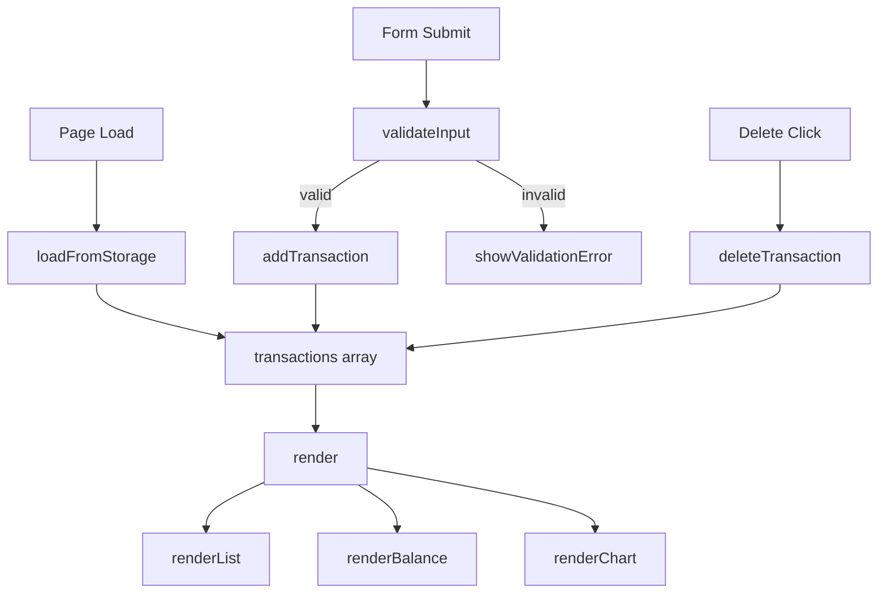

# Design Document

## Overview

A client-side Expense & Budget Visualizer implemented as a single HTML page with no build step and no backend. The app lets users log expense transactions (name, amount, category), see a running total balance, browse a scrollable transaction list, and view a live pie chart of spending by category. All state is persisted in `localStorage`.

The technology stack is intentionally minimal:
- Plain HTML5 for structure
- A single CSS file (`css/style.css`) for layout and styling
- A single JavaScript file (`js/app.js`) for all logic
- Chart.js loaded via CDN for the pie chart

---

## Architecture

The app follows a simple **state → render** cycle with no framework:

```
User Action
    │
    ▼
Event Handler (js/app.js)
    │
    ├─► Mutate in-memory state (transactions[])
    │
    ├─► Persist to localStorage
    │
    └─► Re-render UI (Transaction_List, Balance_Display, Chart)
```

All state lives in a single in-memory array (`transactions`). Every mutation (add / delete) writes the full array to `localStorage` and then calls a top-level `render()` function that repaints all three UI regions. This keeps the data flow unidirectional and easy to reason about.



---

## Components and Interfaces

### HTML Structure (`index.html`)

```
<body>
  <header>          — app title
  <main>
    <section#form-section>    — Input_Form
    <section#summary>
      <div#balance>           — Balance_Display
      <canvas#chart>          — Chart (Chart.js target)
    <section#list-section>    — Transaction_List
```

### Input_Form

- Text input: `name` (required, non-empty after trim)
- Number input: `amount` (required, must be > 0)
- Select: `category` with options `Food`, `Transport`, `Fun`
- Submit button
- Error message `<p>` element (hidden by default, shown on validation failure)

On valid submit: calls `addTransaction(name, amount, category)`, then resets the form.  
On invalid submit: displays an inline error message, does not add a transaction.

### Transaction_List

Rendered by `renderList(transactions)`. Each row shows:
- Item name
- Amount (formatted as currency)
- Category badge
- Delete button (triggers `deleteTransaction(id)`)

When `transactions` is empty, renders a single "No transactions yet." message.  
The list container has `overflow-y: auto` with a fixed max-height to enable scrolling.

### Balance_Display

Rendered by `renderBalance(transactions)`. Computes `sum(transactions.map(t => t.amount))` and displays it formatted as currency (e.g. `$0.00`).

### Chart

Rendered/updated by `renderChart(transactions)`. Uses Chart.js `'pie'` type.  
- Data: one entry per category that has a non-zero total
- Labels: category names
- Colors: fixed per category (Food → green, Transport → blue, Fun → orange)
- If no transactions exist, the chart is destroyed/hidden and a placeholder message is shown

The Chart.js instance is stored in a module-level variable so it can be `.destroy()`-ed and recreated on each render (simplest approach for a small dataset).

---

## Data Models

### Transaction Object

```js
{
  id: string,        // crypto.randomUUID() or Date.now().toString()
  name: string,      // item name, non-empty
  amount: number,    // positive float, e.g. 12.50
  category: string   // "Food" | "Transport" | "Fun"
}
```

### In-Memory State

```js
let transactions = []; // Transaction[]
```

### localStorage Schema

Key: `"vj-transactions"`  
Value: JSON-serialised `Transaction[]`

```js
// Write
localStorage.setItem("vj-transactions", JSON.stringify(transactions));

// Read
const raw = localStorage.getItem("vj-transactions");
transactions = raw ? JSON.parse(raw) : [];
```

On parse error (malformed JSON), the app catches the exception, logs a warning, and initialises `transactions = []`.

### Category Totals (derived, not stored)

```js
// Computed on demand for the chart
const totals = transactions.reduce((acc, t) => {
  acc[t.category] = (acc[t.category] ?? 0) + t.amount;
  return acc;
}, {});
```

---

## Correctness Properties

*A property is a characteristic or behavior that should hold true across all valid executions of a system — essentially, a formal statement about what the system should do. Properties serve as the bridge between human-readable specifications and machine-verifiable correctness guarantees.*


### Property 1: Valid transaction insertion round-trip

*For any* non-empty item name, positive numeric amount, and valid category, calling `addTransaction` should result in the transaction appearing in the in-memory list and in `localStorage`, with the stored JSON deserialising back to an equivalent object.

**Validates: Requirements 1.2, 5.2**

---

### Property 2: Invalid inputs are rejected (empty fields)

*For any* form submission where at least one of name (after trim), amount, or category is missing or empty, the transaction list should remain unchanged in both length and content.

**Validates: Requirements 1.3**

---

### Property 3: Invalid inputs are rejected (non-positive amount)

*For any* amount value that is zero, negative, or non-numeric, the transaction list should remain unchanged in both length and content.

**Validates: Requirements 1.4**

---

### Property 4: Form resets after successful add

*For any* valid transaction that is successfully added, the rendered form's name, amount, and category fields should all return to their default empty/initial state.

**Validates: Requirements 1.5**

---

### Property 5: Transaction list renders all stored transactions

*For any* non-empty array of transactions, the rendered HTML of the Transaction_List should contain each transaction's name, formatted amount, and category — with no transaction omitted.

**Validates: Requirements 2.1**

---

### Property 6: Delete removes transaction from list and storage

*For any* transaction present in the list, calling `deleteTransaction(id)` should result in that transaction no longer appearing in the in-memory list and no longer being present in the `localStorage` JSON.

**Validates: Requirements 2.3, 5.2**

---

### Property 7: Balance equals sum of all transaction amounts

*For any* array of transactions (including the empty array), the value displayed by `renderBalance` should equal the arithmetic sum of all `amount` fields, formatted as a currency string. Edge cases: empty list → `$0.00`; single transaction → its own amount.

**Validates: Requirements 3.1, 3.2, 3.3, 3.4**

---

### Property 8: Chart data matches category totals

*For any* array of transactions, the data passed to Chart.js should contain exactly one entry per category whose total is greater than zero, and each entry's value should equal the sum of amounts for that category. Categories with a zero total must be absent from the chart data.

**Validates: Requirements 4.1, 4.2, 4.3, 4.4**

---

### Property 9: localStorage round-trip preserves all transactions

*For any* array of transactions, serialising to `localStorage` and then deserialising via `loadFromStorage` should produce an array that is deeply equal to the original.

**Validates: Requirements 5.1**

---

### Property 10: Corrupt localStorage initialises to empty list

*For any* string that is not valid JSON (or is absent), `loadFromStorage` should return an empty array without throwing.

**Validates: Requirements 5.3**

---

## Error Handling

| Scenario | Handling |
|---|---|
| Empty / whitespace name | Inline validation error; form not submitted |
| Amount ≤ 0 or non-numeric | Inline validation error; form not submitted |
| `localStorage` parse error | Catch exception, log warning, initialise `transactions = []` |
| `localStorage` unavailable (e.g. private browsing quota) | Wrap writes in try/catch; app continues in-memory only |
| Chart.js not loaded (CDN failure) | Chart section shows a fallback message; rest of app still works |

All error messages are displayed inline near the relevant UI element. No alerts or console-only errors for user-facing failures.

---

## Testing Strategy

### Dual Testing Approach

Both unit tests and property-based tests are required. They are complementary:

- **Unit tests** cover specific examples, integration points, and edge cases.
- **Property tests** verify universal invariants across randomly generated inputs.

### Property-Based Testing Library

Use **fast-check** (JavaScript) for all property-based tests.

```
npm install --save-dev fast-check
```

Each property test must run a minimum of **100 iterations** (fast-check default is 100; set `numRuns: 100` explicitly).

Each test must include a comment tag in the format:

```
// Feature: vanilla-js-web-app, Property <N>: <property_text>
```

### Property Tests

Each correctness property from the design maps to exactly one property-based test:

| Property | Test description | fast-check arbitraries |
|---|---|---|
| P1 | Valid transaction insertion round-trip | `fc.string()`, `fc.float({min:0.01})`, `fc.constantFrom('Food','Transport','Fun')` |
| P2 | Empty-field submissions rejected | Arbitraries that produce at least one blank field |
| P3 | Non-positive amount rejected | `fc.float({max:0})`, `fc.string()` for non-numeric |
| P4 | Form resets after add | Same as P1; check DOM state after add |
| P5 | List renders all transactions | `fc.array(transactionArbitrary)` |
| P6 | Delete removes from list and storage | `fc.array(transactionArbitrary, {minLength:1})` |
| P7 | Balance equals sum | `fc.array(transactionArbitrary)` including empty array |
| P8 | Chart data matches category totals | `fc.array(transactionArbitrary)` |
| P9 | localStorage round-trip | `fc.array(transactionArbitrary)` |
| P10 | Corrupt localStorage → empty list | `fc.string()` filtered to non-JSON strings |

### Unit Tests

Unit tests focus on:

- **Specific examples**: adding a single known transaction and asserting exact output
- **Edge cases**: empty transaction list renders "No transactions yet.", balance shows `$0.00` with no transactions, chart shows placeholder with no transactions
- **Error conditions**: form submit with each individual field missing, amount = 0, amount = -1, amount = "abc"
- **Integration**: add then delete the same transaction leaves the list empty and localStorage empty

### Test File Layout

```
tests/
  unit/
    transactions.test.js   — addTransaction, deleteTransaction, loadFromStorage
    balance.test.js        — renderBalance
    chart.test.js          — buildChartData
    validation.test.js     — validateForm
  property/
    transactions.prop.js   — P1, P2, P3, P6, P9, P10
    balance.prop.js        — P7
    chart.prop.js          — P8
    ui.prop.js             — P4, P5
```
